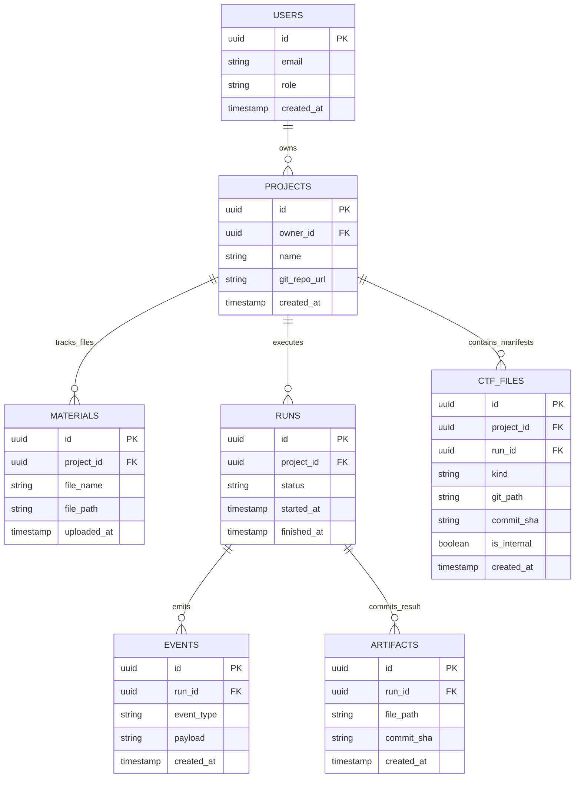

# ADR-001: Каноническая модель хранения сущности Project на базе PostgreSQL и Git-репозитория

- **Статус:** Proposed[cite: 7]
- **Дата:** 2026-10-06[cite: 7]
- **Контекст:** Эпик 2.5 (пакет v3), требования заказчика по хранению артефактов в Git, интеграция с направлениями 2.1 и 2.3 (PPS-141)[cite: 1, 7]
- **Целевой артефакт:** docs/adr/ADR-001-storage.md[cite: 2, 7]
- **Зависимости:** Gateway, Runner, Auth/ownership[cite: 1, 2, 7]

---

## 1. Контекст и проблематика

В рамках разработки веб-направления CoreTeam необходимо формализовать схему хранения сущности Project и связанных с ней подсущностей[cite: 1, 7].

Система взаимодействует со следующими компонентами[cite: 1, 2, 7]:
* Gateway: точка входа клиентских запросов, валидация прав, оркестрация сессий[cite: 1, 2, 7].
* Auth/ownership: сервис авторизации и разграничения прав доступа к сущностям и репозиториям[cite: 1, 2, 7].
* Runner: исполняющая среда пайплайнов, порождающая события и артефакты[cite: 1, 2, 7].

### Требования и ограничения:
1. Git-as-Storage для результатов: По требованию заказчика для хранения сгенерированных отчетов, результатов работы команды (Markdown-артефактов) и сопутствующих манифестов вместо объектного S3-хранилища используется Git-репозиторий проекта[cite: 7].
2. Версионирование коммитами: Каждая подтвержденная версия артефакта фиксируется уникальным commit_sha[cite: 7].
3. Разделение контуров: Внутренние рассуждения моделей, промежуточные токены и секреты не попадают в Git и не транслируются в публичные события[cite: 7].
4. Консистентность статусов: Статус completed выставляется только после успешного git commit / git push и фиксации события artifact_saved[cite: 7].
5. Метаданные и события в PostgreSQL: Метаданные проектов, права доступа, сессии пользователей и упорядоченный журнал публичных событий хранятся в реляционной БД[cite: 7].

---

## 2. Разделение ролей хранения (Storage Roles)

Для исключения конфликтов обязанностей фиксируются роли компонентов хранения[cite: 1, 7]:

| Слой хранения | Роль и назначение | Характер данных |
|---|---|---|
| PostgreSQL[cite: 1, 7] | Источник истины (Source of Truth) для реляционных связей, метаданных сущностей, статусов запусков, индексации и упорядоченного журнала событий[cite: 7]. | Структурированные метаданные, транзакционные обновления, быстрые выборки по фильтрам[cite: 7]. |
| Git-репозиторий[cite: 1, 7] | Версионированное хранилище отчетов, декларативных материалов и служебных конфигураций CoreTeam[cite: 7]. | Markdown-документы (result.md), манифесты (.ctf/*.json), версионируемые входные спецификации[cite: 7]. |
| Object Storage (S3)[cite: 1, 7] | Выведено из архитектуры v1 по требованию заказчика[cite: 7]. Резервируется в бэклоге архитектуры как внешний слой для тяжелых бинарных данных (>50–100 МБ) через интеграцию с Git LFS или внешний bucket[cite: 7]. | Временные неструктурированные дампы, тяжелые бинарные датасеты[cite: 7]. |

---

## 3. Архитектурное решение (Decision)

### 3.1. Структура каталогов в Git-репозитории

```text
repo-root/
└── projects/
    └── {project_id}/
        ├── materials/              # Входные файлы пользователя[cite: 7]
        │   └── dataset_spec.pdf
        ├── .ctf/                   # Служебные файлы фреймворка (манифесты, роли)[cite: 7]
        │   ├── team_manifest.json
        │   └── framework_state.json
        └── runs/
            └── {run_id}/
                └── result.md       # Итоговый подтвержденный артефакт[cite: 7]
```

### 3.2. ER-диаграмма сущностей



### 3.3. Спецификация моделей данных (PostgreSQL)

#### 1. Projects (projects)[cite: 7]
* id (UUID, Primary Key)[cite: 7]
* owner_id (UUID, Foreign Key)[cite: 7]
* title (VARCHAR(255))[cite: 7]
* description (TEXT)[cite: 7]
* status (VARCHAR(32)): draft | team_proposed | active | archived[cite: 7]
* git_repo_url (VARCHAR(512)) — ссылка на рабочий репозиторий[cite: 7]
* git_branch (VARCHAR(128), default: 'main') — ветка проекта[cite: 7]
* context_data (JSONB) — цели, входные требования, история ответов фасилитатору[cite: 7]
* schema_version (INT, default: 1) — счетчик оптимистической блокировки[cite: 7]
* created_at, updated_at, deleted_at (TIMESTAMPTZ)[cite: 7]

#### 2. Materials (materials)[cite: 7]
* id (UUID, Primary Key)[cite: 7]
* project_id (UUID, Foreign Key)[cite: 7]
* filename (VARCHAR(255))[cite: 7]
* mime_type (VARCHAR(128))[cite: 7]
* size_bytes (BIGINT)[cite: 7]
* git_path (VARCHAR(512)) — путь внутри репозитория (projects/{project_id}/materials/...)[cite: 7]
* commit_sha (VARCHAR(40)) — коммит добавления материала[cite: 7]
* created_at (TIMESTAMPTZ)[cite: 7]

#### 3. Runs (runs)[cite: 7]
* id (UUID, Primary Key)[cite: 7]
* project_id (UUID, Foreign Key)[cite: 7]
* status (VARCHAR(32)): queued | running | waiting_for_input | partial | completed | failed | cancelled | limit_reached | unknown[cite: 7]
* current_sequence (INT, default: 0)[cite: 7]
* last_artifact_id (UUID, Foreign Key к artifacts, nullable)[cite: 7]
* last_heartbeat_at (TIMESTAMPTZ, nullable) — маркер активности воркера Runner[cite: 7]
* started_at, finished_at, created_at (TIMESTAMPTZ)[cite: 7]

#### 4. Events (events)[cite: 7]
* id (UUID, Primary Key)[cite: 7]
* run_id (UUID, Foreign Key)[cite: 7]
* project_id (UUID, Foreign Key)[cite: 7]
* sequence (INT, составной уникальный индекс UNIQUE(run_id, sequence))[cite: 7]
* type (VARCHAR(64)) — публичный тип (role_progress, artifact_saved и др.)[cite: 7]
* actor (JSONB) — роль CoreTeam (roleId, displayName)[cite: 7]
* payload (JSONB) — нормализованные данные шага (прогресс, текст, ETA)[cite: 7]
* created_at (TIMESTAMPTZ)[cite: 7]

#### 5. Artifacts (artifacts)[cite: 7]
* id (UUID, Primary Key)[cite: 7]
* project_id (UUID, Foreign Key)[cite: 7]
* run_id (UUID, Foreign Key)[cite: 7]
* title (VARCHAR(255))[cite: 7]
* mime_type (VARCHAR(64), default: text/markdown)[cite: 7]
* git_path (VARCHAR(512)) — путь к файлу (projects/{project_id}/runs/{run_id}/result.md)[cite: 7]
* commit_sha (VARCHAR(40)) — хеш коммита Git с зафиксированным результатом[cite: 7]
* git_tree_url (VARCHAR(512)) — URL для просмотра коммита/файла в веб-интерфейсе Git[cite: 7]
* size_bytes (BIGINT)[cite: 7]
* created_at (TIMESTAMPTZ)[cite: 7]

#### 6. CTF Files (ctf_files)[cite: 7]
* id (UUID, Primary Key)[cite: 7]
* project_id (UUID, Foreign Key)[cite: 7]
* run_id (UUID, Foreign Key, nullable)[cite: 7]
* kind (VARCHAR(64)): team_manifest | role_definition | framework_state[cite: 7]
* git_path (VARCHAR(512)) — путь в скрытом каталоге (projects/{project_id}/.ctf/...)[cite: 7]
* commit_sha (VARCHAR(40))[cite: 7]
* is_internal (BOOLEAN, default: true) — изоляция от публичного API[cite: 7]
* created_at (TIMESTAMPTZ)[cite: 7]

### 3.4. Валидационные типы интерфейсов (TypeScript)

```typescript
export interface ArtifactGit {
  artifactId: string;
  projectId: string;
  runId: string;
  title: string;
  mimeType: 'text/markdown';
  gitPath: string;
  commitSha: string;
  gitTreeUrl?: string;
  sizeBytes: number;
  createdAt: string;
}

export interface MaterialGit {
  materialId: string;
  projectId: string;
  filename: string;
  mimeType: string;
  gitPath: string;
  commitSha: string;
  sizeBytes: number;
  createdAt: string;
}
```

---

## 4. Семантика записи (Write Semantics)[cite: 1, 7]

### 4.1. Сценарий Confirmed Write (Двухфазное подтверждение)[cite: 1, 7]
1. Runner формирует результирующий Markdown-файл в изолированном локальном каталоге[cite: 1, 2, 7].
2. Runner выполняет коммит и пуш файла по пути projects/{project_id}/runs/{run_id}/result.md в удаленный репозиторий[cite: 7]. Фиксируется commit_sha[cite: 7].
3. Gateway открывает транзакцию в PostgreSQL[cite: 1, 2, 7]:
   * Создается запись в таблице artifacts с привязкой к commit_sha[cite: 7].
   * Статус в таблице runs обновляется на completed[cite: 7].
   * В журнал events вставляется событие с типом artifact_saved[cite: 7].
4. Gateway возвращает клиенту код 200 OK[cite: 1, 2, 7].

### 4.2. Обработка Unknown Outcome (Сетевые сбои и таймауты)[cite: 1, 7]
* Путь артефакта детерминирован идентификаторами (projects/{project_id}/runs/{run_id}/result.md), что исключает появление дубликатов[cite: 7].
* При сбое Runner опрашивает Git: если коммит уже существует, повторная генерация пропускается, и система сразу повторяет фиксацию статуса в PostgreSQL[cite: 1, 2, 7].
* Коммиты без подтверждённой транзакции в базе данных по истечении 24 часов вычищаются фоновым аудитом[cite: 1, 7].

---

## 5. Управление жизненным циклом и целостностью[cite: 1, 7]

### 5.1. Version Conflict (Разрешение конфликтов версий)[cite: 1, 7]
* На уровне Git конфликты исключены за счет изоляции каталогов под каждый run_id (projects/{project_id}/runs/{run_id}/)[cite: 7].
* На уровне PostgreSQL применяется оптимистическая блокировка через поле schema_version (при параллельной записи возвращается ошибка 409 Conflict)[cite: 7].

### 5.2. Recovery (Восстановление после сбоев)[cite: 1, 7]
* Во время работы Runner каждые 30 секунд обновляет поле last_heartbeat_at[cite: 1, 2, 7].
* Фоновый Reaper раз в минуту находит задачи со статусом running без обновлений более 5 минут и переводит их в failed с кодом TIMEOUT[cite: 7].

### 5.3. Delete & Retention (Удаление и политики хранения)[cite: 1, 7]
* Soft Delete: Заполняется projects.deleted_at, статус меняется на archived, данные скрываются из API на 30 дней[cite: 7].
* Hard Delete: Через 30 дней фоновый процесс выполняет git rm -rf projects/{project_id} и каскадно очищает строки в PostgreSQL[cite: 7].
* Retention: Логи events архивируются/удаляются через 90 дней, метаданные проектов и итоговые артефакты хранятся бессрочно[cite: 7].

---

## 6. Анализ альтернатив и архитектурный компромисс (Trade-off Analysis)[cite: 7]

В процессе проектирования рассматривался вопрос полного отказа от Object Storage (S3) в пользу чистого Git для всех видов данных проекта[cite: 1, 7].

### 6.1. Сравнение подходов

| Критерий | Только Git | Только S3 / Object Storage | Гибрид: Git + S3 / Git LFS (Целевой) |
|---|---|---|---|
| Аудит и версионирование | Нативное версионирование строк, наглядный git diff и веб-просмотр коммитов[cite: 7]. | Версионирование целых BLOB-объектов без семантического diff. | git diff для Markdown-отчетов + хеш-версионирование для бинарных данных. |
| Работа с бинарными данными | Неэффективно: репозиторий раздувается навсегда, тяжелые git clone[cite: 7]. | Оптимизировано: высокая скорость потоковой передачи и прямая загрузка по Presigned URL. | Разделение: текст коммитится в Git, тяжелые файлы уходят в S3/LFS[cite: 7]. |
| Параллельная запись | Ограничено: блокировки и очереди при частых параллельных git push[cite: 7]. | Высокая: параллельная независимая запись тысяч объектов без коллизий. | Изоляция запусков по каталогам в Git + параллельная запись тяжелых тел в S3. |
| Удаление (Hard Delete / GDPR) | Трудоемко: требует опасной перезаписи истории коммитов (git filter-repo)[cite: 7]. | Просто: мгновенное удаление объекта или очистка по S3 Lifecycle. | Метаданные и текст очищаются коммитом, бинарники стираются из S3 без пересборки Git-дерева[cite: 7]. |
| Сложность инфраструктуры | Минимальная: не требуется отдельный S3-кластер на старте[cite: 7]. | Требует отдельного S3/MinIO сервиса и управления политиками доступа. | Минимальная на этапе v1 (только Git)[cite: 7] с прозрачным переходом на S3/LFS при масштабировании. |

### 6.2. Риски использования только Git и принятый компромисс

1. Почему не только Git: Прямое сохранение тяжелых файлов (PDF, датасеты) в Git раздувает репозиторий, замедляя git clone воркеров, а полное удаление (Hard Delete) требует опасной пересборки всей истории коммитов[cite: 1, 2, 7].
2. Компромисс:
   * Этап 1 (v1 — Epic 2.5): Работа только через PostgreSQL + чистый Git для Markdown-отчетов и ограничение на размер входных файлов до 10 МБ[cite: 1, 2, 7].
   * Этап 2 (Целевой): Подключение Git LFS или Object Storage (S3) для тяжелых материалов, оставляя в Git только текст отчетов и манифесты[cite: 1, 7].
