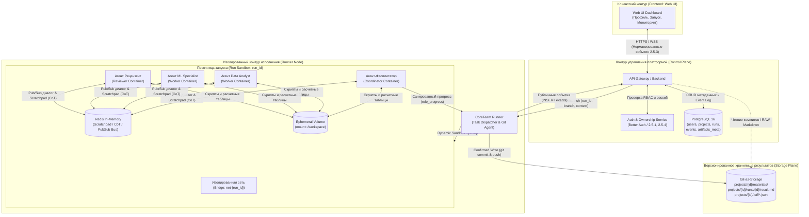
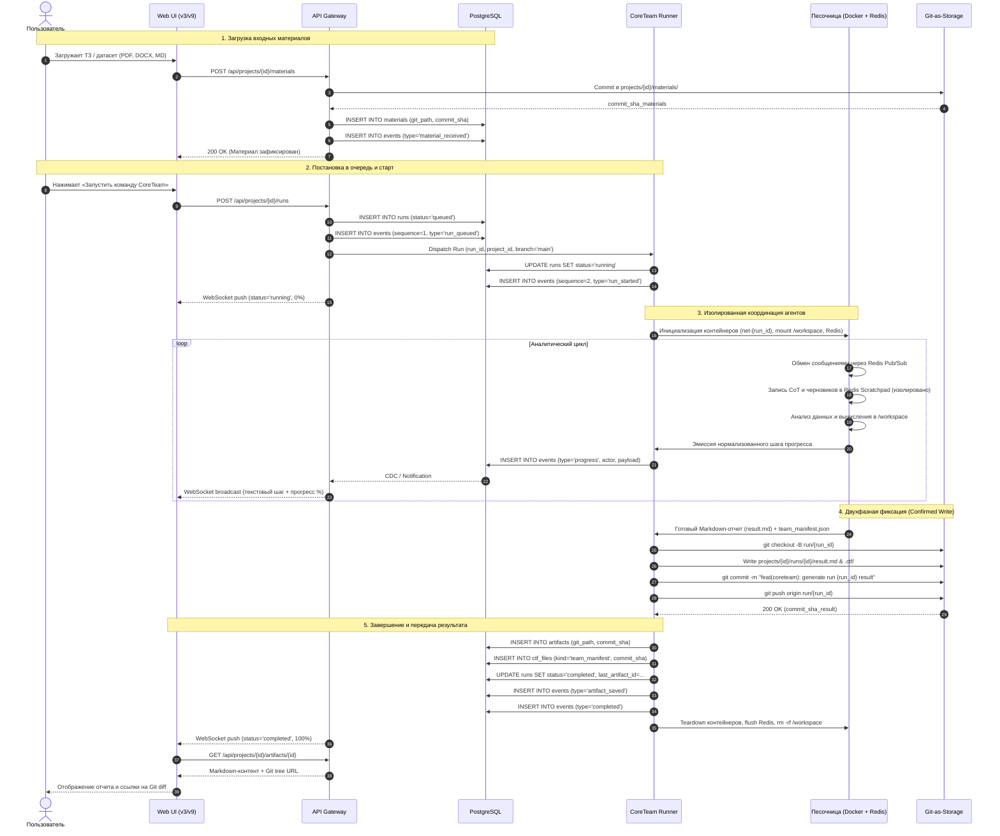

# ADR-001: Каноническая модель хранения сущности Project на базе PostgreSQL и Git-репозитория, контейнеризация агентов и жизненный цикл данных

- **Статус:** Proposed[span_0](start_span)[span_0](end_span)
- **Дата:** 2026-10-01[span_1](start_span)[span_1](end_span)
- **Контекст:** Эпик 2.5 (пакет закрытия v3), задача PPS-141 (S2 Storage ADR), интеграция со спецификациями 2.5-1, 2.5-2, 2.5-3, 2.5-8[span_2](start_span)[span_2](end_span)[span_3](start_span)[span_3](end_span)[span_4](start_span)[span_4](end_span)
- **Целевой артефакт:** `docs/adr/ADR-001-storage.md`[span_5](start_span)[span_5](end_span)[span_6](start_span)[span_6](end_span)
- **Ветка интеграции:** `PPS-2/web-demo/epic-2.5-v3`[span_7](start_span)[span_7](end_span)
- **Зависимости:** Gateway, Runner, Auth/ownership (`2.5-1`, `2.5-4`)[span_8](start_span)[span_8](end_span)[span_9](start_span)[span_9](end_span)

---

## 1. Контекст и проблематика

В рамках разработки серверного контура платформы CoreTeam необходимо зафиксировать каноническую модель хранения сущности `Project` и связанных с ней подсущностей[span_10](start_span)[span_10](end_span)[span_11](start_span)[span_11](end_span). 

По прямому требованию заказчика для долговременного хранения сгенерированных отчетов, результатов аналитической работы (Markdown-артефактов) и сопутствующих манифестов вместо внешнего объектного S3-хранилища должен использоваться **Git-репозиторий**[span_12](start_span)[span_12](end_span)[span_13](start_span)[span_13](end_span).

### Архитектурные требования и ограничения:
1. **Git-as-Storage для результатов:** Итоговые подтвержденные артефакты (`text/markdown`) и служебные конфигурации фреймворка сохраняются коммитами в целевой Git-репозиторий проекта[span_14](start_span)[span_14](end_span).
2. **Версионирование коммитами:** Каждая подтвержденная версия артефакта строго фиксируется уникальным `commit_sha`[span_15](start_span)[span_15](end_span).
3. **Разделение контуров безопасности:** Внутренние рассуждения моделей (Chain-of-Thought), промежуточные токены, shell-команды, системные логи и секреты не попадают в Git и не передаются в публичные события платформы (`2.5-3`, `2.5-8`)[span_16](start_span)[span_16](end_span)[span_17](start_span)[span_17](end_span)[span_18](start_span)[span_18](end_span).
4. **Консистентность статусов (Confirmed Write):** Статус `completed` выставляется в БД только после подтвержденного `git commit` / `git push` и фиксации публичного события `artifact_saved` (`2.5-2`, `2.5-3`)[span_19](start_span)[span_19](end_span)[span_20](start_span)[span_20](end_span)[span_21](start_span)[span_21](end_span).
5. **Метаданные и события в PostgreSQL:** Метаданные проектов, права доступа, сессии пользователей и строгий упорядоченный журнал публичных событий хранятся в реляционной СУБД[span_22](start_span)[span_22](end_span)[span_23](start_span)[span_23](end_span).
6. **Контейнерная изоляция исполнителей:** Мультиагентная команда CoreTeam развертывается в изолированной песочнице на Runner-ноде без прямого внешнего сетевого доступа к промежуточным файлам, дебатам и отладке[span_24](start_span)[span_24](end_span).

---

## 2. Архитектурное решение (Decision)

Принята гибридная архитектура **PostgreSQL + Git-as-Storage** с изолированным контейнерным рантаймом **Runner Sandbox**[span_25](start_span)[span_25](end_span):
- **PostgreSQL 16:** хранит профили пользователей, сессии, метаданные проектов, статусы запусков (`runs`) и журнал публичных событий (`events`)[span_26](start_span)[span_26](end_span).
- **Git-репозиторий:** выступает неизменяемым версионированным хранилищем входных материалов (`materials`), готовых отчетов (`artifacts`) и системных манифестов (`ctf_files`)[span_27](start_span)[span_27](end_span).
- **Runner Sandbox (Docker + Redis In-Memory):** изолированная среда исполнения на узле CoreTeam Runner, объединяющая контейнеры агентов в приватную сеть с шиной взаимодействия в оперативной памяти и общим временным рабочим диском.

### 2.1. Топология системы и компонентное взаимодействие



---

### 2.2. Контейнеризация и межагентное взаимодействие

#### Развертывание и жизненный цикл контейнеров
1. **Среда выполнения (Runner Node):** 
   - Все контейнеры агентов развертываются локально на узле выполнения **CoreTeam Runner**.
   - Runner динамически инициализирует легковесный контейнерный стек под каждый конкретный запуск (`run_id`).
   - Контейнеры запускаются с жесткими ограничениями по ресурсам (cgroups: лимиты CPU и RAM) и read-only системным корнем.
   - По завершении формирования артефакта или в случае аварии стек контейнеров принудительно останавливается и удаляется (`docker rm -f`), не оставляя неудаленных процессов.

#### Межагентный транспорт и разделение контуров памяти
- **Виртуальная изоляция (`Bridge Network`):** Локальная подсеть `net-{run_id}` замыкает сетевой обмен строго внутри песочницы. Прямой доступ из внешней сети в контейнеры заблокирован.
- **Шина обмена сообщениями (Redis In-Memory):**
  - **Диалоговый канал (Pub/Sub):** Агенты координируют распределение задач и передачу промежуточных результатов через каналы Redis (`channel:coordination`, `channel:tasks`).
  - **Scratchpad (Рабочая память цепочки рассуждений):** Промежуточные рассуждения моделей (CoT), сырые вызовы тулов и внутренние гипотезы сохраняются в оперативной памяти Redis со сроком жизни, равным времени выполнения запуска (TTL = Run Duration).
  - **Политика безопасности (`2.5-3`):** Данные из Scratchpad **никогда не покидают песочницу**, не записываются в PostgreSQL и не попадают в Git[span_28](start_span)[span_28](end_span)[span_29](start_span)[span_29](end_span). Вся память Redis сбрасывается и освобождается при Teardown песочницы.
- **Общий рабочий том (`Ephemeral Volume: /workspace`):**
  - Монтируется в контейнеры текущего запуска.
  - Позволяет агентам обмениваться промежуточными файлами (скриптами анализа, сырыми выгрузками таблиц, промежуточными вычислениями).
  - Уничтожается хостовым процессом Runner'а сразу после выгрузки финального отчета.

---

### 2.3. Структура каталогов в Git-репозитории

Каждый проект и запуск изолированы в структуре директорий репозитория[span_30](start_span)[span_30](end_span):

```text
repo-root/
└── projects/
    └── {project_id}/
        ├── materials/              # Входные файлы пользователя (2.5-8: PDF, DOCX, TXT, MD, PNG, JPG)
        │   └── dataset_spec.pdf
        ├── .ctf/                   # Служебные файлы фреймворка (манифесты, роли)
        │   ├── team_manifest.json
        │   └── framework_state.json
        └── runs/
            └── {run_id}/
                └── result.md       # Итоговый подтвержденный артефакт (Markdown)
```

---

### 2.4. Реляционная модель данных (PostgreSQL)

erDiagram
    USERS ||--o{ PROJECTS : "владеет"
    PROJECTS ||--o{ RUNS : "запускает"
    RUNS ||--o{ CONTAINERS : "содержит стек агентов"
    RUNS ||--o{ ARTIFACTS : "порождает артефакты"
    PROJECTS ||--o{ ARTIFACTS : "содержит артефакты"

    USERS {
        uuid id PK
        string email
        string role
        timestamp created_at
    }

    PROJECTS {
        uuid id PK
        uuid owner_id FK
        string title
        string git_repo_url
        string status
    }

    RUNS {
        uuid id PK
        uuid project_id FK
        string status
        uuid last_artifact_id FK
    }

    CONTAINERS {
        uuid id PK
        uuid run_id FK
        string docker_container_id
        string agent_role
        string image_tag
        string network_name
        string status
    }

    ARTIFACTS {
        uuid id PK
        uuid project_id FK
        uuid run_id FK
        string title
        string git_path
        string commit_sha
        string git_tree_url
    }

### 2.5. Спецификация таблиц PostgreSQL

#### 1. Проекты (`projects`)[span_31](start_span)[span_31](end_span)
- `id` (UUID, Primary Key)[span_32](start_span)[span_32](end_span)
- `owner_id` (UUID, Foreign Key $\rightarrow$ `users.id`) — идентификатор владельца (`2.5-1`)[span_33](start_span)[span_33](end_span)[span_34](start_span)[span_34](end_span)
- `title` (VARCHAR(255)) — название проекта[span_35](start_span)[span_35](end_span)
- `description` (TEXT) — описание проекта[span_36](start_span)[span_36](end_span)
- `status` (VARCHAR(32)) — статус: `draft` | `team_proposed` | `active` | `archived`[span_37](start_span)[span_37](end_span)
- `git_repo_url` (VARCHAR(512)) — путь к Git-репозиторию проекта[span_38](start_span)[span_38](end_span)
- `git_branch` (VARCHAR(128), default: `'main'`) — целевая ветка[span_39](start_span)[span_39](end_span)
- `context_data` (JSONB) — цели проекта, вводные данные, ответы фасилитатору[span_40](start_span)[span_40](end_span)
- `schema_version` (INT, default: `1`)[span_41](start_span)[span_41](end_span)
- `created_at`, `updated_at` (TIMESTAMPTZ)[span_42](start_span)[span_42](end_span)

#### 2. Входные материалы (`materials`)[span_43](start_span)[span_43](end_span)
- `id` (UUID, Primary Key)[span_44](start_span)[span_44](end_span)
- `project_id` (UUID, Foreign Key $\rightarrow$ `projects.id`)[span_45](start_span)[span_45](end_span)
- `filename` (VARCHAR(255)) — оригинальное имя файла[span_46](start_span)[span_46](end_span)
- `mime_type` (VARCHAR(128)) — поддерживаемые типы (`2.5-8`: PDF, DOCX, TXT, MD, PNG, JPG)[span_47](start_span)[span_47](end_span)[span_48](start_span)[span_48](end_span)
- `size_bytes` (BIGINT) — размер файла в байтах[span_49](start_span)[span_49](end_span)
- `git_path` (VARCHAR(512)) — путь в Git (`projects/{project_id}/materials/...`)[span_50](start_span)[span_50](end_span)
- `commit_sha` (VARCHAR(40)) — хеш коммита фиксации файла в Git[span_51](start_span)[span_51](end_span)
- `created_at` (TIMESTAMPTZ)[span_52](start_span)[span_52](end_span)

#### 3. Запуски пайплайна (`runs`)[span_53](start_span)[span_53](end_span)
- `id` (UUID, Primary Key)[span_54](start_span)[span_54](end_span)
- `project_id` (UUID, Foreign Key $\rightarrow$ `projects.id`)[span_55](start_span)[span_55](end_span)
- `status` (VARCHAR(32)) — канонический статус жизненного цикла (`2.5-2`):[span_56](start_span)[span_56](end_span)[span_57](start_span)[span_57](end_span)
  - `queued` | `running` | `waiting_for_input` | `completed` | `failed` | `cancelled` | `limit_reached` | `partial` | `unknown`[span_58](start_span)[span_58](end_span)[span_59](start_span)[span_59](end_span)
- `current_sequence` (INT, default: `0`) — инкрементный счетчик для упорядочивания событий[span_60](start_span)[span_60](end_span)
- `last_artifact_id` (UUID, Foreign Key $\rightarrow$ `artifacts.id`, nullable) — ссылка на сохраненный артефакт[span_61](start_span)[span_61](end_span)
- `started_at`, `finished_at`, `created_at` (TIMESTAMPTZ)[span_62](start_span)[span_62](end_span)

#### 4. Публичные события (`events`)[span_63](start_span)[span_63](end_span)
- `id` (UUID, Primary Key)[span_64](start_span)[span_64](end_span)
- `run_id` (UUID, Foreign Key $\rightarrow$ `runs.id`)[span_65](start_span)[span_65](end_span)
- `project_id` (UUID, Foreign Key $\rightarrow$ `projects.id`)[span_66](start_span)[span_66](end_span)
- `sequence` (INT) — строгий порядковый номер (составной уникальный индекс `UNIQUE(run_id, sequence)`)[span_67](start_span)[span_67](end_span)
- `type` (VARCHAR(64)) — публичный тип события (`2.5-3`):[span_68](start_span)[span_68](end_span)[span_69](start_span)[span_69](end_span)
  - `run_queued` | `run_started` | `progress` | `waiting_for_input` | `material_received` | `artifact_proposed` | `artifact_saved` | `completed` | `failed` | `unknown` | `limit_reached`[span_70](start_span)[span_70](end_span)
- `actor` (JSONB) — отображаемая роль CoreTeam (`{"roleId": "data_analyst", "displayName": "Аналитик данных"}`)[span_71](start_span)[span_71](end_span)
- `payload` (JSONB) — нормализованные безопасные данные (прогресс, текстовое описание этапа)[span_72](start_span)[span_72](end_span)
- `created_at` (TIMESTAMPTZ)[span_73](start_span)[span_73](end_span)

#### 5. Подтвержденные артефакты (`artifacts`)[span_74](start_span)[span_74](end_span)
- `id` (UUID, Primary Key)[span_75](start_span)[span_75](end_span)
- `project_id` (UUID, Foreign Key $\rightarrow$ `projects.id`)[span_76](start_span)[span_76](end_span)
- `run_id` (UUID, Foreign Key $\rightarrow$ `runs.id`)[span_77](start_span)[span_77](end_span)
- `title` (VARCHAR(255)) — заголовок отчета[span_78](start_span)[span_78](end_span)
- `mime_type` (VARCHAR(64), default: `'text/markdown'`)[span_79](start_span)[span_79](end_span)
- `git_path` (VARCHAR(512)) — путь к файлу (`projects/{project_id}/runs/{run_id}/result.md`)[span_80](start_span)[span_80](end_span)
- `commit_sha` (VARCHAR(40)) — SHA коммита подтвержденной записи в Git[span_81](start_span)[span_81](end_span)
- `git_tree_url` (VARCHAR(512)) — ссылка для просмотра коммита в интерфейсе Git[span_82](start_span)[span_82](end_span)
- `size_bytes` (BIGINT) — размер отчета[span_83](start_span)[span_83](end_span)
- `created_at` (TIMESTAMPTZ)[span_84](start_span)[span_84](end_span)

#### 6. Манифесты фреймворка (`ctf_files`)[span_85](start_span)[span_85](end_span)
- `id` (UUID, Primary Key)[span_86](start_span)[span_86](end_span)
- `project_id` (UUID, Foreign Key $\rightarrow$ `projects.id`)[span_87](start_span)[span_87](end_span)
- `run_id` (UUID, Foreign Key $\rightarrow$ `runs.id`, nullable)[span_88](start_span)[span_88](end_span)
- `kind` (VARCHAR(64)): `team_manifest` | `role_definition` | `framework_state`[span_89](start_span)[span_89](end_span)
- `git_path` (VARCHAR(512)) — путь (`projects/{project_id}/.ctf/...`)[span_90](start_span)[span_90](end_span)
- `commit_sha` (VARCHAR(40))[span_91](start_span)[span_91](end_span)
- `is_internal` (BOOLEAN, default: `true`) — признак изоляции от клиентского UI[span_92](start_span)[span_92](end_span)
- `created_at` (TIMESTAMPTZ)[span_93](start_span)[span_93](end_span)

---

### 2.6. Контракты типизации данных (TypeScript)

```typescript
export type RunCanonicalStatus = 
  | 'queued'
  | 'running'
  | 'waiting_for_input'
  | 'completed'
  | 'failed'
  | 'cancelled'
  | 'limit_reached'
  | 'partial'
  | 'unknown';

export type PublicEventType =
  | 'run_queued'
  | 'run_started'
  | 'progress'
  | 'waiting_for_input'
  | 'material_received'
  | 'artifact_proposed'
  | 'artifact_saved'
  | 'completed'
  | 'failed'
  | 'unknown'
  | 'limit_reached';

export interface PublicEventPayload {
  eventId: string;
  projectId: string;
  runId: string;
  sequence: number;
  type: PublicEventType;
  actor?: {
    roleId: string;
    displayName: string;
  };
  payload: {
    message: string;
    percentage?: number;
    question?: string;
    options?: string[];
  };
  createdAt: string;
}

export interface ArtifactGit {
  artifactId: string;
  projectId: string;
  runId: string;
  title: string;
  mimeType: 'text/markdown';
  gitPath: string;            // projects/{projectId}/runs/{runId}/result.md
  commitSha: string;          // 40-значный SHA фиксации результата
  gitTreeUrl?: string;        // Путь на коммит в Git
  sizeBytes: number;
  createdAt: string;
}

export interface MaterialGit {
  materialId: string;
  projectId: string;
  filename: string;
  mimeType: 'application/pdf' | 'application/vnd.openxmlformats-officedocument.wordprocessingml.document' | 'text/plain' | 'text/markdown' | 'image/png' | 'image/jpeg';
  gitPath: string;            // projects/{projectId}/materials/{filename}
  commitSha: string;
  sizeBytes: number;
  createdAt: string;
}
```

---

## 3. Пользовательский путь и жизненный цикл выполнения (User Journey)

### 3.1. Сквозная последовательность операций



---

## 4. Сводная матрица хранения данных платформы

| Категория информации | Состав данных и сущностей | Где физически хранится | Точное место / Таблица / Путь | Срок хранения (Retention) | Контур доступа и политика безопасности |
| :--- | :--- | :--- | :--- | :--- | :--- |
| **Учетные записи и доступы** | Пользователи, роли (гость/пользователь/админ), сессии (`2.5-1`, `2.5-4`)[span_94](start_span)[span_94](end_span) | **PostgreSQL**[span_95](start_span)[span_95](end_span) | Таблицы `users`, `sessions`, `project_members` | Бессрочно. Обновление по действию пользователя. | Конфиденциально. Внутренний контур авторизации (`2.5-4`)[span_96](start_span)[span_96](end_span). |
| **Параметры проектов** | Название, описание, статус, Git-путь, ветка, контекст диалога[span_97](start_span)[span_97](end_span) | **PostgreSQL**[span_98](start_span)[span_98](end_span) | Таблица `projects`[span_99](start_span)[span_99](end_span) | Бессрочно. Мягкое удаление (`archived`)[span_100](start_span)[span_100](end_span). | Доступно владельцу и участникам проекта (`2.5-1`)[span_101](start_span)[span_101](end_span). |
| **Состояния выполнения** | Статус запуска (`queued`, `running`, `completed` и др.), таймстемпы[span_102](start_span)[span_102](end_span)[span_103](start_span)[span_103](end_span) | **PostgreSQL**[span_104](start_span)[span_104](end_span) | Таблица `runs`[span_105](start_span)[span_105](end_span) | Бессрочно (сохраняется аудит-история всех запусков). | Публичный статус для интерфейса пользователя (`2.5-2`)[span_106](start_span)[span_106](end_span). |
| **Журнал событий платформы** | Нормализованные этапы, прогресс %, роль CoreTeam, безопасные тексты[span_107](start_span)[span_107](end_span)[span_108](start_span)[span_108](end_span) | **PostgreSQL**[span_109](start_span)[span_109](end_span) | Таблица `events` (индекс `run_id + sequence`)[span_110](start_span)[span_110](end_span) | Бессрочно. Доступен для воспроизведения истории в UI. | Публичный поток событий для веб-интерфейса (`2.5-3`)[span_111](start_span)[span_111](end_span). |
| **Межагентный диалог (CoT)** | Промежуточные дебаты, CoT-рассуждения моделей, JSON-RPC, токены | **Redis In-Memory** (Runner RAM) | Каналы Pub/Sub `agent:*`, ключи `run:{id}:scratchpad:*` | **Эфемерно:** TTL = время выполнения запуска. Очищается при Teardown. | **Строго изолировано.** Запрещено транслировать в БД, Git и UI (`2.5-3`)[span_112](start_span)[span_112](end_span)[span_113](start_span)[span_113](end_span). |
| **Промежуточные файлы вычислений** | Временные Python-скрипты, расчетные таблицы, сырые промежуточные CSV | **Runner Ephemeral Volume** (`tmpfs` / локальный диск) | Монтирование: `/workspace` | **Эфемерно:** удаляется принудительно сразу после завершения Run. | Изолированная песочница запуска. |
| **Входные материалы** | Пользовательские документы, описания датасетов, технические задания[span_114](start_span)[span_114](end_span) | **Git-as-Storage**[span_115](start_span)[span_115](end_span) + метаданные в **PostgreSQL**[span_116](start_span)[span_116](end_span) | Git: `projects/{id}/materials/*`[span_117](start_span)[span_117](end_span)<br>DB: таблица `materials`[span_118](start_span)[span_118](end_span) | Бессрочно. Версионируется уникальным `commit_sha`[span_119](start_span)[span_119](end_span). | Доступно участникам проекта с правами чтения. |
| **Манифесты CoreTeam** | Конфигурация команды, роли, внутреннее состояние фреймворка[span_120](start_span)[span_120](end_span) | **Git-as-Storage**[span_121](start_span)[span_121](end_span) + метаданные в **PostgreSQL**[span_122](start_span)[span_122](end_span) | Git: `projects/{id}/.ctf/*.json`[span_123](start_span)[span_123](end_span)<br>DB: таблица `ctf_files`[span_124](start_span)[span_124](end_span) | Бессрочно в Git. Флаг `is_internal = true`[span_125](start_span)[span_125](end_span). | Скрыто от клиентского интерфейса (`2.5-7`)[span_126](start_span)[span_126](end_span)[span_127](start_span)[span_127](end_span). |
| **Итоговые результаты** | Сгенерированные Markdown-отчеты команды агентов[span_128](start_span)[span_128](end_span) | **Git-as-Storage**[span_129](start_span)[span_129](end_span) + метаданные в **PostgreSQL**[span_130](start_span)[span_130](end_span) | Git: `projects/{id}/runs/{id}/result.md`[span_131](start_span)[span_131](end_span)<br>DB: таблица `artifacts`[span_132](start_span)[span_132](end_span) | **Иммутабельно:** жестко привязано к SHA коммита (`commit_sha`)[span_133](start_span)[span_133](end_span). | Подтвержденный результат для пользователя и заказчика[span_134](start_span)[span_134](end_span). |

---

## 5. Надежность, консистентность и безопасные ошибки

Регламенты устойчивости к отказам соответствуют критериям приемки PPS-141[span_135](start_span)[span_135](end_span) и спецификациям `2.5-2`[span_136](start_span)[span_136](end_span), `2.5-3`[span_137](start_span)[span_137](end_span), `2.5-8`[span_138](start_span)[span_138](end_span):

### 5.1. Confirmed Write (Двухфазная фиксация)[span_139](start_span)[span_139](end_span)
- Статус `completed` выставляется в PostgreSQL **строго после** успешного `git push` в репозиторий[span_140](start_span)[span_140](end_span).
- Порядок шагов:
  1. Runner производит локальный коммит артефакта `result.md`[span_141](start_span)[span_141](end_span).
  2. Выполняется отправка в ветку запуска: `git push origin run/{run_id}`.
  3. После получения кода возврата `0` от Git-сервера создается запись в таблице `artifacts` с полученным `commit_sha`[span_142](start_span)[span_142](end_span).
  4. Запись в таблице `runs` переводится в `completed` с привязкой `last_artifact_id`[span_143](start_span)[span_143](end_span)[span_144](start_span)[span_144](end_span).
  5. Генерируется и записывается публичное событие `artifact_saved`, после чего — событие `completed`[span_145](start_span)[span_145](end_span)[span_146](start_span)[span_146](end_span).

### 5.2. Unknown Outcome (Обработка обрывов соединения и Reconciliation Worker)[span_147](start_span)[span_147](end_span)
- Если во время операции `git push` происходит таймаут или потеря сетевого пакета:
  - Runner переводит запуск в канонический статус `unknown` (`2.5-2`)[span_148](start_span)[span_148](end_span)[span_149](start_span)[span_149](end_span).
  - Пользователю отдается безопасное сообщение: *«Связь с исполнителем прервалась. Мы не помечаем работу завершённой, пока результат не подтверждён»* (`2.5-8`)[span_150](start_span)[span_150](end_span).
  - Активируется фоновый **Reconciliation Worker**:
    - Выполняет опрос удаленного репозитория через `git ls-remote` на наличие ветки `run/{run_id}` и целевого `commit_sha`.
    - **Коммит обнаружен в Git:** транзакция подтверждается — создается запись в `artifacts`, статус обновляется на `completed`, генерируется `artifact_saved`[span_151](start_span)[span_151](end_span)[span_152](start_span)[span_152](end_span)[span_153](start_span)[span_153](end_span).
    - **Коммит отсутствует:** статус переводится в `failed` с возможностью повторного перезапуска пользователем (`2.5-2`)[span_154](start_span)[span_154](end_span).

### 5.3. Предотвращение конфликтов параллельной записи (Version Conflict)[span_155](start_span)[span_155](end_span)
- Во избежание merge-конфликтов:
  - Каждый запуск изолирован в собственном каталоге: `projects/{project_id}/runs/{run_id}/`[span_156](start_span)[span_156](end_span).
  - Запись ведется в отдельную ветку `run/{run_id}`.
  - При возникновении одновременных изменений пользователю выдается безопасный текст: *«Результат изменился в другой вкладке. Обновите проект и повторите действие»* (`2.5-8`)[span_157](start_span)[span_157](end_span). Внутренние ID версий и структура БД скрываются[span_158](start_span)[span_158](end_span).

### 5.4. Матрица маскирования безопасных ошибок (`2.5-8`)[span_159](start_span)[span_159](end_span)

| Ситуация сбоя | Текст, отображаемый пользователю (`2.5-8`)[span_160](start_span)[span_160](end_span) | Что строго скрывается от пользователя (`2.5-8`, `2.5-3`)[span_161](start_span)[span_161](end_span)[span_162](start_span)[span_162](end_span) |
| :--- | :--- | :--- |
| **Общая ошибка запуска (`failed`)**[span_163](start_span)[span_163](end_span)[span_164](start_span)[span_164](end_span) | Работу не удалось завершить. Данные проекта и последняя подтверждённая версия сохранены[span_165](start_span)[span_165](end_span). | Stack trace, stdout/stderr, ID контейнера, путь в файловой системе хоста[span_166](start_span)[span_166](end_span)[span_167](start_span)[span_167](end_span). |
| **Исход неизвестен (`unknown`)**[span_168](start_span)[span_168](end_span)[span_169](start_span)[span_169](end_span) | Связь с исполнителем прервалась. Мы не помечаем работу завершённой, пока результат не подтверждён[span_170](start_span)[span_170](end_span). | Сетевые IP-адреса, топология шлюза Gateway, внутренние счетчики повторов (retries)[span_171](start_span)[span_171](end_span)[span_172](start_span)[span_172](end_span). |
| **Недостаточный лимит (`limit_reached`)**[span_173](start_span)[span_173](end_span)[span_174](start_span)[span_174](end_span) | Доступного лимита недостаточно. Команда не запускалась и кредиты не списывались[span_175](start_span)[span_175](end_span). | Внутренняя формула расчета затрат, API-ключи LLM-провайдеров[span_176](start_span)[span_176](end_span)[span_177](start_span)[span_177](end_span). |
| **Нет доступа / Ошибка владения**[span_178](start_span)[span_178](end_span) | Проект недоступен или не существует[span_179](start_span)[span_179](end_span). | Факт существования чужого проекта и персональные данные его владельца[span_180](start_span)[span_180](end_span). |
| **Неподдерживаемый формат файла**[span_181](start_span)[span_181](end_span) | Этот файл не удалось обработать. Добавьте PDF, DOCX, TXT, MD, PNG или JPG[span_182](start_span)[span_182](end_span). | Имя системного парсера, абсолютный системный путь и дампы логов[span_183](start_span)[span_183](end_span). |
| **Истечение сессии**[span_184](start_span)[span_184](end_span) | Сессия завершилась. Войдите снова — сохранённые проекты останутся доступны[span_185](start_span)[span_185](end_span). | Сырые JWT-токены, причины отказа серверной валидации[span_186](start_span)[span_186](end_span). |
| **Конфликт версии артефакта**[span_187](start_span)[span_187](end_span) | Результат изменился в другой вкладке. Обновите проект и повторите действие[span_188](start_span)[span_188](end_span). | Внутренние первичные ключи БД, структура таблиц и SHA коммита[span_189](start_span)[span_189](end_span). |
| **Недоступность платформы / моделей**[span_190](start_span)[span_190](end_span) | Сейчас не удаётся продолжить работу. Попробуйте позже; сохранённые данные не потеряны[span_191](start_span)[span_191](end_span). | Имя провайдера нейросети, статусы upstream-сервисов, топология кластера[span_192](start_span)[span_192](end_span). |

---

## 6. Последствия архитектурного решения (Consequences)

### Положительные:
- **Полное соответствие требованиям заказчика:** Артефакты и конфигурации хранятся в Git-репозитории без использования внешнего S3[span_193](start_span)[span_193](end_span).
- **Аудируемость и неизменяемость:** Каждый отчет зафиксирован криптографическим хешем коммита (`commit_sha`). Возможно использование нативного `git diff` для сравнения запусков[span_194](start_span)[span_194](end_span).
- **Просмотр в интерфейсе Git:** Markdown-отчеты открываются и читаются стандартными средствами веб-интерфейса платформы[span_195](start_span)[span_195](end_span).
- **Надежная защита интеллектуальной собственности и секретов:** Строгое разделение памяти (Redis) и постоянного хранилища (Git/PG) исключает утечку промптов и промежуточных вычислений[span_196](start_span)[span_196](end_span)[span_197](start_span)[span_197](end_span).

### Ограничения и риски:
- **Размер бинарных файлов в Git:** Для v1 ограничение несущественно, так как итоговый артефакт — Markdown-документ[span_198](start_span)[span_198](end_span). При расширении скоупа платформы на тяжелые файлы (> 50–100 МБ) потребуется внедрение Git LFS[span_199](start_span)[span_199](end_span).
- **Сериализация операций с Git:** Запись коммитов через изолированные ветки `run/{run_id}` требует обязательной фоновой сборки или fast-forward слияния для предотвращения lock-блокировок индекса.
