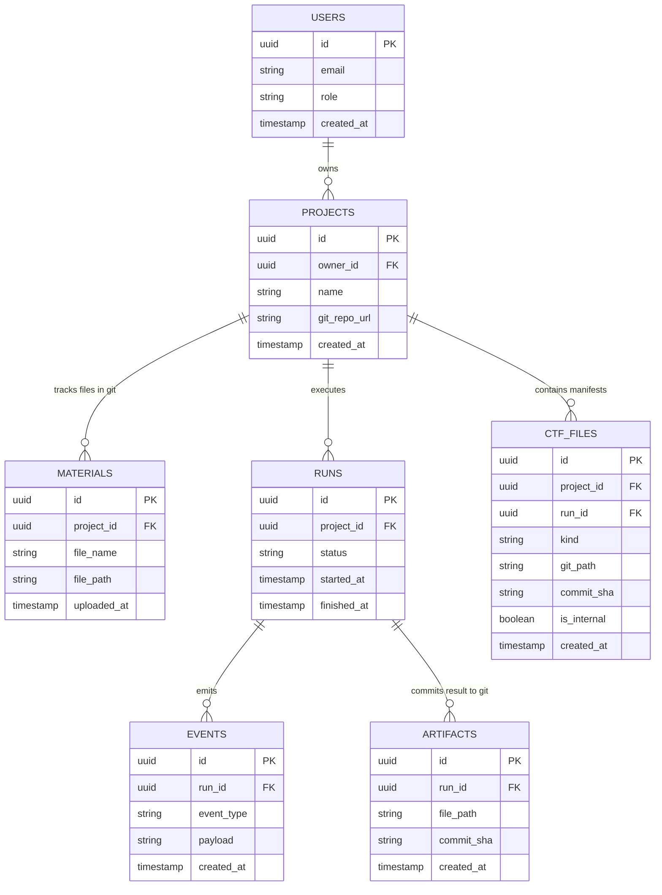

# ADR-001: Каноническая модель хранения сущности Project на базе PostgreSQL и Git-репозитория

- **Статус:** Proposed
- **Дата:** 2026-10-01
- **Контекст:** Эпик 2.5 (пакет v3), требования заказчика по хранению артефактов в Git, интеграция с направлениями 2.1 и 2.3
- **Целевой артефакт:** `docs/adr/ADR-001-storage.md`

---

## 1. Контекст и проблематика

В рамках разработки веб-направления CoreTeam необходимо формализовать схему хранения сущности `Project` и связанных с ней подсущностей. 

По требованию заказчика для хранения сгенерированных отчетов, результатов работы команды (Markdown-артефактов) и сопутствующих манифестов вместо объектного S3-хранилища должен использоваться **Git-репозиторий**.

### Требования и ограничения:
1. **Git-as-Storage для результатов:** Итоговые подтвержденные артефакты (`text/markdown`) и внутренние конфигурации фреймворка коммитятся в Git-репозиторий проекта.
2. **Версионирование коммитами:** Каждая подтвержденная версия артефакта фиксируется уникальным `commit_sha`.
3. **Разделение контуров:** Внутренние рассуждения моделей, промежуточные токены и секреты не попадают в Git и не транслируются в публичные события.
4. **Консистентность статусов:** Статус `completed` выставляется только после успешного `git commit` / `git push` и фиксации события `artifact_saved`.
5. **Метаданные и события в PostgreSQL:** Метаданные проектов, права доступа, сессии пользователей и упорядоченный журнал публичных событий хранятся в реляционной БД.

---

## 2. Архитектурное решение (Decision)

Принята гибридная схема **PostgreSQL + Git**:
- **PostgreSQL:** хранит профили пользователей, метаданные проектов, состояние текущего запуска (`runs`) и строгий упорядоченный журнал публичных событий (`events`).
- **Git-репозиторий:** выступает версионированным хранилищем входных материалов, сгенерированных отчетов (`artifacts`) и служебных манифестов (`ctf_files`).

### 2.1. Структура каталогов в Git-репозитории

Каждый проект и запуск изолированы в структуре директорий репозитория:

```text
repo-root/
└── projects/
    └── {project_id}/
        ├── materials/              # Входные файлы пользователя
        │   └── dataset_spec.pdf
        ├── .ctf/                   # Служебные файлы фреймворка (манифесты, роли)
        │   ├── team_manifest.json
        │   └── framework_state.json
        └── runs/
            └── {run_id}/
                └── result.md       # Итоговый подтвержденный артефакт
```

### 2.2. ER-диаграмма сущностей


2.3. Спецификация подсущностей
1. Projects (projects)
id (UUID, Primary Key)

owner_id (UUID, Foreign Key)

title (VARCHAR(255))

description (TEXT)

status (VARCHAR(32)): draft | team_proposed | active | archived

git_repo_url (VARCHAR(512)) — ссылка на рабочий репозиторий

git_branch (VARCHAR(128), default: 'main') — ветка проекта

context_data (JSONB) — цели, входные требования, история ответов фасилитатору

schema_version (INT, default: 1)

created_at, updated_at (TIMESTAMPTZ)

2. Materials (materials)
id (UUID, Primary Key)

project_id (UUID, Foreign Key)

filename (VARCHAR(255))

mime_type (VARCHAR(128))

size_bytes (BIGINT)

git_path (VARCHAR(512)) — путь внутри репозитория (projects/{project_id}/materials/...)

commit_sha (VARCHAR(40)) — коммит добавления материала

created_at (TIMESTAMPTZ)

3. Runs (runs)
id (UUID, Primary Key)

project_id (UUID, Foreign Key)

status (VARCHAR(32)): queued | running | waiting_for_input | partial | completed | failed | cancelled | limit_reached | unknown

current_sequence (INT, default: 0)

last_artifact_id (UUID, Foreign Key к artifacts, nullable)

started_at, finished_at, created_at (TIMESTAMPTZ)

4. Events (events)
id (UUID, Primary Key)

run_id (UUID, Foreign Key)

project_id (UUID, Foreign Key)

sequence (INT, составной уникальный индекс UNIQUE(run_id, sequence))

type (VARCHAR(64)) — публичный тип (role_progress, artifact_saved и др.)

actor (JSONB) — роль CoreTeam (roleId, displayName)

payload (JSONB) — нормализованные данные шага (прогресс, текст, ETA)

created_at (TIMESTAMPTZ)

5. Artifacts (artifacts)
id (UUID, Primary Key)

project_id (UUID, Foreign Key)

run_id (UUID, Foreign Key)

title (VARCHAR(255))

mime_type (VARCHAR(64), default: text/markdown)

git_path (VARCHAR(512)) — путь к файлу (projects/{project_id}/runs/{run_id}/result.md)

commit_sha (VARCHAR(40)) — хеш коммита Git с зафиксированным результатом

git_tree_url (VARCHAR(512)) — URL для просмотра коммита/файла в веб-интерфейсе Git

size_bytes (BIGINT)

created_at (TIMESTAMPTZ)

6. CTF Files (ctf_files)
id (UUID, Primary Key)

project_id (UUID, Foreign Key)

run_id (UUID, Foreign Key, nullable)

kind (VARCHAR(64)): team_manifest | role_definition | framework_state

git_path (VARCHAR(512)) — путь в скрытом каталоге (projects/{project_id}/.ctf/...)

commit_sha (VARCHAR(40))

is_internal (BOOLEAN, default: true) — изоляция от публичного API интерфейса

created_at (TIMESTAMPTZ)

2.4. Типы валидации (TypeScript / Pydantic)
```TypeScript
export interface ArtifactGit {
  artifactId: string;
  projectId: string;
  runId: string;
  title: string;
  mimeType: 'text/markdown';
  gitPath: string;            // projects/{projectId}/runs/{runId}/result.md
  commitSha: string;          // 40-символьный SHA фиксации результата
  gitTreeUrl?: string;        // Ссылка на просмотр в Git
  sizeBytes: number;
  createdAt: string;
}

export interface MaterialGit {
  materialId: string;
  projectId: string;
  filename: string;
  mimeType: string;
  gitPath: string;
  commitSha: string;
  sizeBytes: number;
  createdAt: string;
}
```
3. Последствия (Consequences)
Положительные:
Соответствие требованиям заказчика: Полное исключение стороннего S3-хранилища для артефактов первой версии.

Встроенное версионирование и аудит: Каждая версия отчета привязана к неизменяемому коммиту (commit_sha). Заказчик может использовать git diff для сравнения результатов разных запусков.

Удобный просмотр: Пользователь или эксперт может просматривать сгенерированные Markdown-отчеты напрямую в веб-интерфейсе репозитория (GitHub/GitLab).

Ограничения и риски:
Конфликты параллельной записи: Необходима сериализация коммитов (блокировка или раздельные ветки под каждый runId), чтобы избежать merge-конфликтов.

Ограничение на размер файлов: Git не предназначен для хранения тяжелых бинарников (более 50–100 МБ). В v1 это приемлемо, так как артефакт — Markdown-документ, но для больших файлов в будущем потребуется подключение Git LFS.

